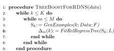

===============
Getting Started
===============

  .. toctree::
     :glob:
     :maxdepth: 1

Installation
------------

``rfgb`` can be installed via the following methods:

1. Stable builds on `PyPi <https://pypi.org/project/rfgb/>`_

   .. code-block:: bash

		   pip install rfgb

2. Development builds on `GitHub <https://github.com/hayesall/rfgb>`_

   .. code-block:: bash

		   pip install git+git://github.com/hayesall/rfgb.git

3. Bleeding-edge development builds on the `GitHub Development Branch <https://github.com/hayesall/rfgb/tree/development>`_

   .. code-block:: bash

		   pip install git+git://github.com/hayesall/rfgb.git@development

Background
----------

The main function of ``rfgb`` is to learn relational dependency networks [#]_ via gradient tree boosting, based on Natarajan et al. "Boosting Relational Dependency Networks" [#]_.

This algorithm is implemented as the ``__main__`` method for the ``rfgb`` package.

.. code-block:: python

		# rfgb.__main__

		from .boosting import updateGradients
		from .tree import node
		from .utils import Utils

		# ... class Arguments:

		parameters = Arguments().args

		for target in parameters.target:

		    # Read the training data
		    trainData = Utils.readTrainingData(target,
		                                       path=parameters.train,
						       regression=parameters.reg,
						       advice=parameters.expAdvice)

		    # Initialize an empty list for the trees.
		    trees = []

		    # Learn each tree and update the gradients.
		    for i in range(parameters.trees):

		        node.setMaxDepth(2)
			node.learnTree(trainData)
			trees.append(node.learnedDecisionTree)
			updateGradients(trainData, trees)

File Structure
--------------

File structure follows the structure used by BoostSRL.

Training directories and testing directories are currently used and flat files are read from, converted to a relational internal representation, and then the relationships may be reasoned about.

References
----------

 .. [#] Jennifer Neville and David Jensen, "Relational Dependency Networks." *Journal of Machine Learning Research (JMLR)*, 2007.
 .. [#] `Siraam Natarajan, Tushar Khot, Kristian Kersting, Bernd Gutmann, and Jude Shavlik, "Boosting Relational Dependency Networks. *International Conference on Inductive Logic Programming (ILP)*, 2010. <https://starling.utdallas.edu/assets/pdfs/boosting10ilp.pdf>`_
